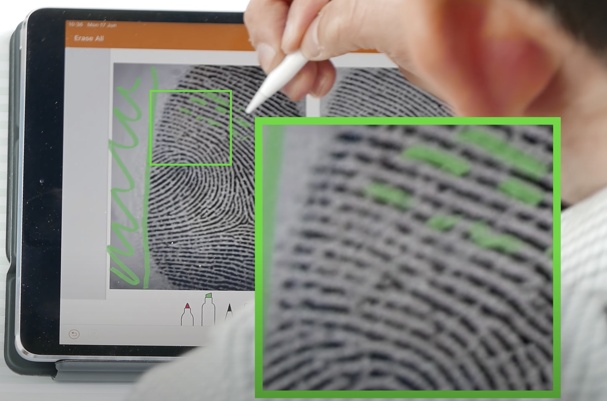
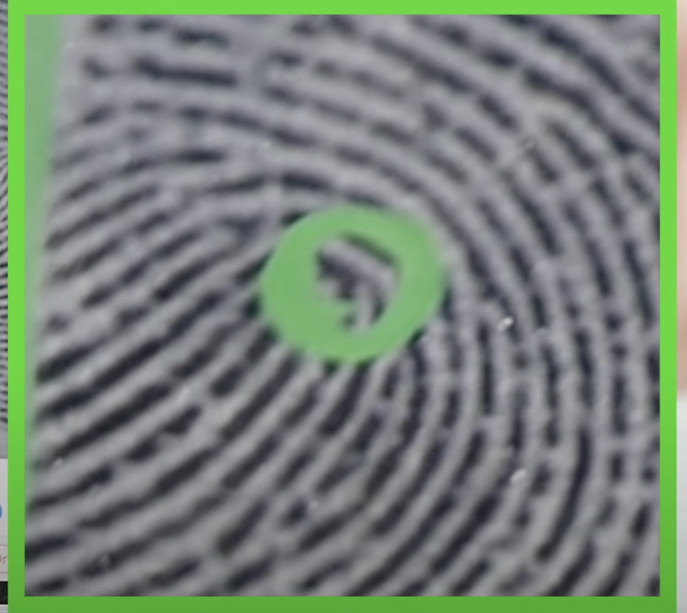
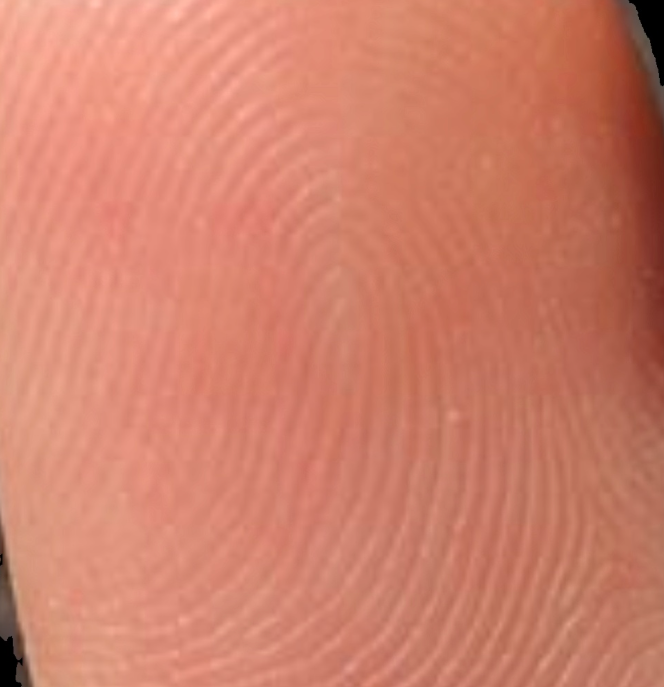
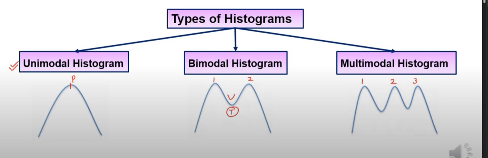
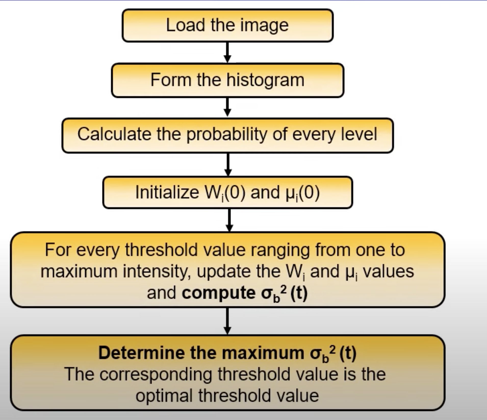
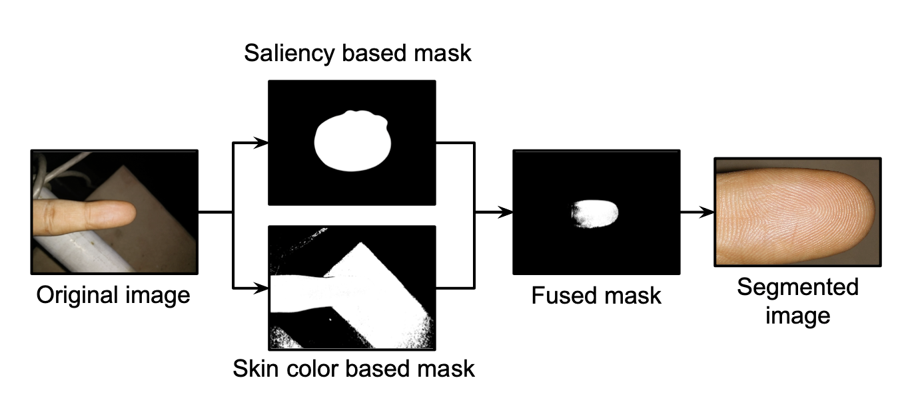

## Implementation of pyhton backend to implement Fingerprint matching
#### Feature Extraction
* Level 1
    * Orientation of fingerprint  
    
    This Image shows how ridges is algined in a particular orintation (which way the ridge is travelling)
    * Whorl or Core
    
    this particular point is called the core of a fingerprint
    * Delta
    
        These are very import for classfication of fingerprint, but not so much for verification
    > Maybe we can start with matching these then move on to mintuia pts
* Minutia points
    * these points are basically `end of a ridge` or `point at which a ridge merges or changes direction`
    * they also exsist on outside of fingerprint
    > Job 1 is to segment just the fingerprint and cropping out the edges
    * pores on ridges **(Not useful since we need a high quality sensor for these)**

#### Fingerprint Matching
1. Alingment of fingerprints (FP) is important as minutia points can wary from photo to photo based on orientation of image clicked

_We won't be facing much on an issue with it because main reason why people use it for is because of different pressure they use while using the fp sensor_

2. For matching fp algo doesn't require to save the whole image it only stores minutia points _saves storage_

3. Main way these algo for fp matching algo work is by using the maximum minutia pts overlaying on each other
Basic idea is to check how many (max) minutia pts can we match with two fingerprints if it is more than a certain % the fingerprints match

 ----------------------------------------------------------------------------------
#### Implemtation

As dicsussed earlier first step is to extract fp from the image
1. Convert image to grayscale
> Use smoothing since image might has noise
2. Use histogram equalisation (Used to enhance contrast) 
#### Principal of thresholding
* Key value is threshold 
**Types of thresholding**
1. Global : depends on grey scale value
2. Local : depends on neighbourhood properties
3. Dynamic : works with pixel coordinates 

> using local thresholding might be useful in case of fps

#### Histogram
* helps in selecting the threshold value (Can be elimated using otsu thresholding)

this shows how to find threshold values in diffrent histograms
1. in unimodal the peak value is used as threshold
2. in bimodal the valley is the threshold
3. in multimodal there are mulitple ways to find threshold values (what are those?)
**Dynamic Thresholding Algo**
- useful in case of non uniform illumination problem
- split in sub sections and then interpolate the threshold via different histograms
- We use optimal thresholding when there is a strong overlapping of histograms

#### Optimal Otsu thresholding
- uses goodness criteria to selesct optimal threshold
-   

#### Proposed idea to segment image
I propose to make two differnt masks and merge them to find the actual mask for the finger.
1. Use the skin tone to create first mask
2. Use Salintent features to create the other mask
after we create the two masks we can take a uniowieghted sum of two to find the final mask we need.

